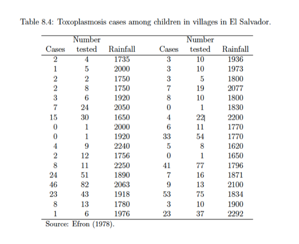
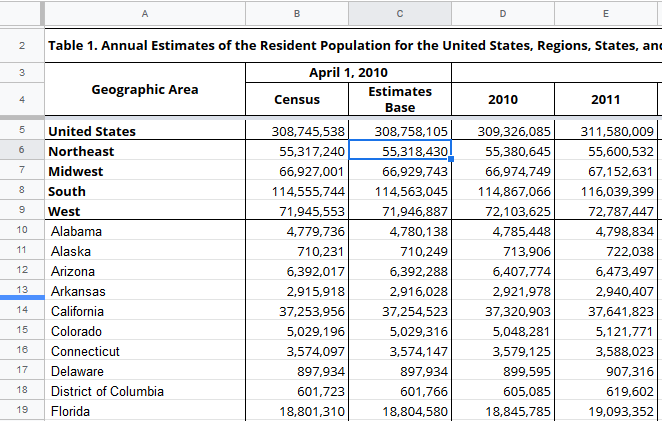
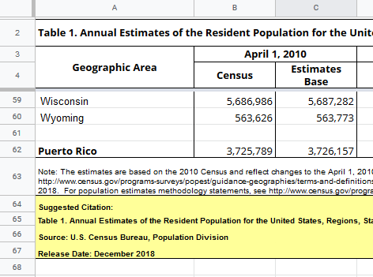

```{r setup, echo=FALSE}     
library("knitr")
opts_chunk$set(comment='')
```

## Outline | What we'll cover today
  
* Intro & general tips
* S1: un-wrapping a table of data
* S2: reading xlsx with `readxls`
  * `dplyr` & `tidyr` interlude
* S3: `tidyverse`: sex and violins

## What R is

* Interpreted, object-oriented language
* Optimized matrix/vector functions
* Large and diverse package community
  * [CRAN](https://cran.r-project.org/web/packages/), [Bioconductor](https://www.bioconductor.org/), Github

## What R isn't

* Beginner friendly
* General purpose
* Memory efficient 

## General Tips 1

* Be practical: use the best tool you are comfortable with (where possible)
  * Learn to navigate with and run basic command in `Terminal.app`, `
* 
* Use version control (`git`) or at least a cloud-sync backup (Dropbox, GDrive)
* 

## General Tips 2

* Use comments to document your code
* Use variable names that are unique and identifying
  * e.g. `temps` or `temperatures` instead of `x` or `v1`
* Avoid hard-coded, repetitive code
  * Write functions to re-use code
  * Store data in strings to re-use them

## `R` Tips

* Use RStudio where available (when performance isn't important)
* Avoid but do not fear loops (they've gotten better)
* Use and request __tidy data__<footnote>[Wickham, H. "Tidy Data" J. Stat. Soft., 2014](https://www.jstatsoft.org/article/view/v059i10)</footnote>
  * Each variable is a column
  * Each observation or case is a row
* pivot / hierarchical tables are for presentation, not analysis


## S1: Publication formatted table

Scenario 1: You're given the pasted text from a manuscript table to analyze



## S1: Raw Text
[data/toxoplasmosis.txt](data/toxoplasmosis.txt)

``` {}
  2  4   1735  3   10   1936 

  1  5   2000  3   10   1973 

  2  2   1750  3    5   1800 

  2  8   1750  7   19   2077 
...
```

## S1: Read the table

_Reminder_: `read.table` skips empty lines

``` {r read.toxo}
colnames <- c("Cases", "tested", "Rainfall")
toxo <- read.table(file="data/toxoplasmosis.txt")
names(toxo) <- rep(colnames, 2)
toxo
```

## S1: Stitch back together
``` {r stitch.toxo}
toxo <- rbind(toxo[,1:3], toxo[,4:6])
summary(toxo)
```

## S2: Read census data from xlsx

Scenario 2: you are given an Excel file with census data <footnote>[from census.gov](https://www.census.gov/newsroom/press-kits/2018/pop-estimates-national-state.html), retrieved Apr 22, 2019 </footnote> to analyze.

_Reminder_: R uses `NA` for character and numeric data (Unlike SAS).

_Reminder_: `read.xlsx` does not skip empty rows unless they are at start or end

## S2: Look at the columns



## S2: Look at the end of the rows



## S2: Read the Excewl file

Install the [`xlsx`](https://cran.r-project.org/web/packages/xlsx/) package 

``` {r states.read}
#install.packages("xlsx")
library(xlsx)
states <- read.xlsx("data/nst-est2018-01.xlsx", sheetIndex=1, startRow=4, endRow=62)
names(states)[1] <- "Geographic.Area"
```

```{r states.clean}
states <- na.omit(states)
states$Geographic.Area <- gsub("\\.", "", states$Geographic.Area)
```

## S2: Cleaned but not tidy

columns as years might be ok for some analysis

"year" column would make date easier to analyze, join to other datasets

## `tidyverse`: `tidyr` & `dplyr`

over past ~5 years [tidyverse](https://www.tidyverse.org/) become very popular in data science

[Tidyverse Cheat Sheets](https://www.rstudio.com/resources/cheatsheets/)

### [`tidyr`](https://tidyr.tidyverse.org): 

* gather() gathers multiple columns into key-value pairs; makes “wide” data longer.

### [`dplyr`](https://dplyr.tidyverse.org): a grammar of data manipulation

* select() picks variables based on their names.
* filter() picks cases based on their values.

## `dplyr` concept: pipes

tidyverse data.frame (tibble)

  `%>%`
function( options)

same as 

## S2: the `tidyverse` way

## S3: Sex and Violins

```
orchest_raw <- read.table(file = "data/symphony.txt")
inst.types <- c("violin", "viola", "cello", "bass")
sexes <- c("male", "female")
colnames = paste(expand.grid(sexes, inst.types)$Var1, expand.grid(sexes, inst.types)$Var2, sep="_")
names(orchest_raw) <- c("name", "total", colnames)

orchestra <- gather(orchest_raw[-2], colnames, key='sex_instrument', value="count")
orchestra <- separate(orchestra, 'sex_instrument', into=c('sex', 'instrument'))
```

## S3: Dummy variables

in R, called design matrices

make sure desired variables (columns) are factors

use `model.matrix` 
