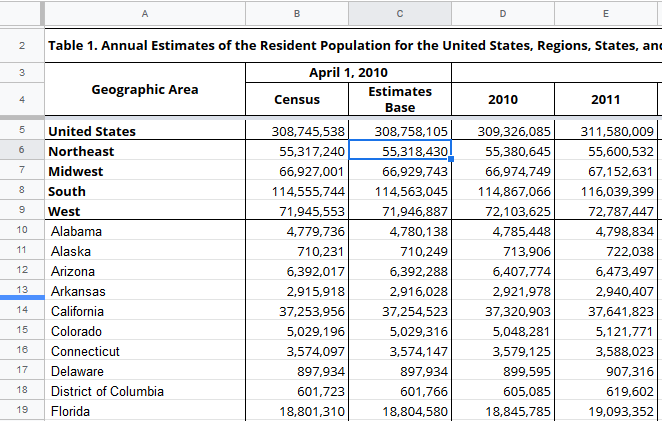
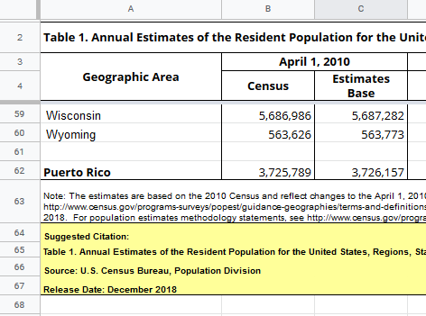
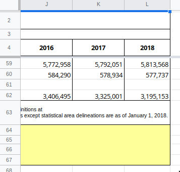
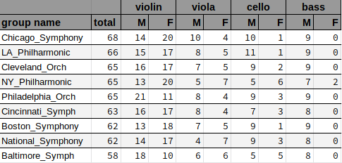

```{r setup, echo=FALSE}     
library("knitr")
opts_chunk$set(comment='')
```

## Outline | What we'll cover today
  
* Intro & general tips
* S1: `R-core`: un-wrapping a table of data
* S2: `tidyverse`: reading census xlsx
* S3: `tidyverse`: sex and violins

## General Tips 1

* Be practical: use the best tool you are comfortable with (where possible)
  * Learn to navigate with and run basic command in `Terminal.app` or [WSL](https://docs.microsoft.com/en-us/windows/wsl/install-win10)
* Be humble: Look for answers and ask for help
* Use version control (`git`) or at least a cloud-sync backup (Dropbox, GDrive)
* Minimize the amount of manual processing of data / results

## General Tips 2

* Use consistent [style](https://style.tidyverse.org)
* Use comments to document your code
* Use variable names that are unique and identifying
    * e.g. `temps` or `temperatures` instead of `x` or `v1`
* Avoid hard-coded, repetitive code
    * Write functions to re-use code

## What R is

* Interpreted, object-oriented language
* Optimized matrix/vector functions
* Large and diverse package community
    * [CRAN](https://cran.r-project.org/web/packages/), [Bioconductor](https://www.bioconductor.org/), Github

## What R isn't

* Beginner friendly
* General purpose
* Memory efficient

## `R` Tips

* Use RStudio where available (when performance isn't important)
* Avoid but do not fear loops (they've gotten better)
* Use and request __tidy data__<footnote>[Wickham, H. "Tidy Data" J. Stat. Soft., 2014](https://www.jstatsoft.org/article/view/v059i10)</footnote>
  * Each variable is a column
  * Each observation or case is a row
* pivot / hierarchical tables are for presentation, not analysis

_Reminder_: R uses `NA` for character and numeric data (Unlike SAS).

## S1: Publication formatted table

Scenario 1: You're given the pasted text from a manuscript table to analyze


## S1: Raw Text
[data/toxoplasmosis.txt](data/toxoplasmosis.txt)

``` {}
  2  4   1735  3   10   1936 

  1  5   2000  3   10   1973 

  2  2   1750  3    5   1800 

  2  8   1750  7   19   2077 
...
```

## S1: Read the table

_Reminder_: `read.table` skips empty lines

``` {r toxo1}
colnames <- c("Cases", "tested", "Rainfall")
toxo <- read.table(file="data/toxoplasmosis.txt")
names(toxo) <- rep(colnames, 2)
toxo
```

## S1: Stitch back together
``` {r toxo2}
toxo <- rbind(toxo[,1:3], toxo[,4:6])
summary(toxo)
```

## S2: Census data from Excel

Scenario 2: you are given an Excel file with census data <footnote>[from census.gov](https://www.census.gov/newsroom/press-kits/2018/pop-estimates-national-state.html), retrieved Apr 22, 2019 </footnote> to analyze.

Let's try using the [`readxl`](https://readxl.tidyverse.org/) package

## S2: Read in the data

``` {r census1}
#install.packages(c("tidyverse","readxl"))
library(readxl)
census_xlsx <- read_excel("data/nst-est2018-01.xlsx")
```

## S2: what went wrong?

``` {r census2}
census_xlsx
```
## S2: Look at the columns

Find top-left cell coordinate to specify for import



## S2: Look at the end of the rows



## S2: Look at the end of the rows

Find bottom-right cell coordinate to specify for import



## S2: Read the Excel file again

``` {r census3}
census_xlsx <- read_excel("data/nst-est2018-01.xlsx", range = "A4:L62")
```
## S2: Cleaned but not tidy

* need to rename first column
* columns as years might be ok for some analysis
  * "year" column would make date easier to analyze, join to other datasets

## `tidyverse`

Over past ~5 years [tidyverse](https://www.tidyverse.org/)<footnote>nice cheatsheets [here](https://www.rstudio.com/resources/cheatsheets/) if you're into that</footnote> has become very popular in data science

Read in data

{width=75px} {width=60px}  {width=75px} {width=75px}

Then manipulate & plot

{width=75px} {width=75px} {width=75px} {width=75px} {width=75px} {width=75px}

## Load `tidyverse`

``` {r loadtidy}
library("tidyverse")
```

## `tidyr` & `dplyr`

### [`tidyr`](https://tidyr.tidyverse.org): reshaping data

* [`gather()`](https://tidyr.tidyverse.org/reference/gather.html) multiple columns to key-value pairs; makes “wide” data longer
* [`drop_na()`](https://tidyr.tidyverse.org/reference/drop_na.html) drops rows with `NA` values

### [`dplyr`](https://dplyr.tidyverse.org): a grammar of data manipulation

* [`select()`](https://dplyr.tidyverse.org/reference/select.html) picks columns based on their names
* [`rename()`](https://dplyr.tidyverse.org/reference/select.htm) renames columns
* [`mutate()`](https://dplyr.tidyverse.org/reference/mutate.html) create or modify data

## `dplyr` concept: pipes

`tidyverse` examples often use pipes

* Borrowed from functional programming / shell languages
* Create effecient, readable chains of functions

```
a %>% b(x) %>% c(y)
```

becomes

```
c(b(a, x), y)
```

## S2: Through the pipes

``` {r census4}
census_tibb <- census_xlsx %>%
  rename(Region = ...1) %>%
  drop_na() %>%
  select(-one_of(c("Census", "Estimates Base"))) %>%
  gather(`2010`:`2018`, key = year, value = pop_estimate)
```

## S2: Tidy census data

``` {r census5}
census_tibb
```

## S2: Tidy census data

``` {r census6}
census_tibb$year <- as.numeric(census_tibb$year)
census_tibb
```

## S2: All together
``` {r census7}
census_xlsx %>%
  rename(Region = ...1) %>%
  drop_na() %>%
  select(-one_of(c("Census", "Estimates Base"))) %>%
  gather(`2010`:`2018`, key = year, value = pop_estimate) %>%
  mutate(year = as.integer(year))
```


## S3: Sex and Violins

Scenario 3: You're given a summary table to run some linear models on



## S3: plain text

The raw text looks like this:

```
Chicago_Symphony  68 14 20 10  4 10  1  9  0

LA_Philharmonic   66 15 17  8  5 11  1  9  0

Cleveland_Orch    65 16 17  7  5  9  2  9  0
...
```

## S3: Column name prep work

``` {r violins1}
inst_types <- c("violin", "viola", "cello", "bass")
sexes <- c("male", "female")
colnames_tmp <- expand.grid(sexes, inst_types)
colnames_tmp
```

## S3: Generate columns
``` {r violins2}
colnames <- as.vector(mapply(paste, sep="_", 
                     colnames_tmp[,1], colnames_tmp[,2]))
colnames <- c("name", "total", colnames)
colnames
```

## S3: Read in table
``` {r violins3}
orchest_raw <- read_table("data/symphony.txt", col_names=colnames)
```

## S3: Examine table
``` {r violins4}
orchest_raw
```

## S3: Gather and separate
``` {r violins5}
orchestra <- gather(orchest_raw, male_violin:female_bass, key='sex_instrument', value="count")
orchestra <- separate(orchestra, 'sex_instrument', into=c('sex', 'instrument'))
orchestra
```

## S3: Dummy variables

* In R, called design matrices
* Make sure desired variables (columns) are factors
* Use `model.matrix`

```{r dummy1}
single_mat <- model.matrix(~instrument, data = orchestra)
head(single_mat)
```

## S3: Dummy variables

* In R, called design matrices
* Make sure desired variables (columns) are factors
* Use `model.matrix`

## S3: More dummy variables

```{r dummy2}
double_mat <- model.matrix(~instrument+sex, data = orchestra)
head(double_mat)
```

## End!

Thanks, questions?